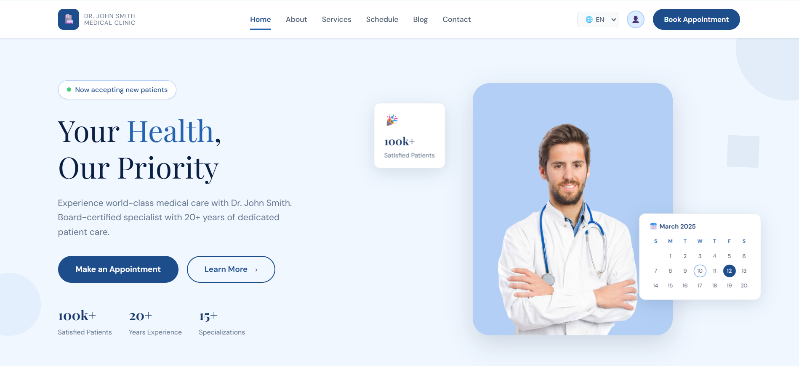
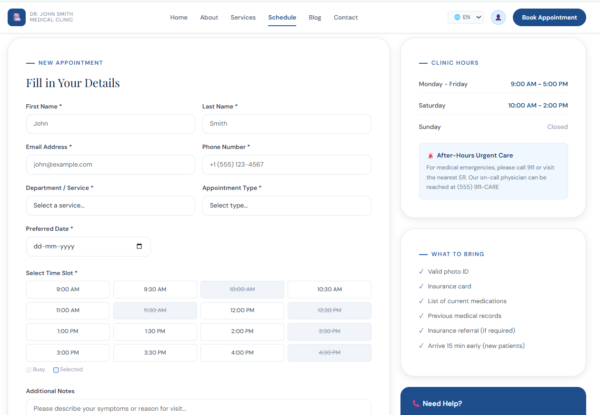
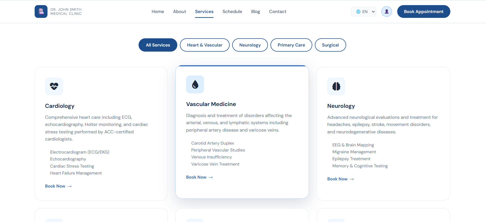
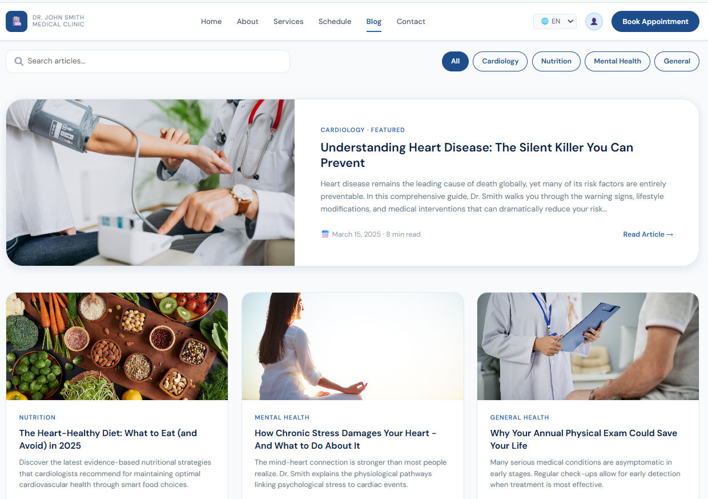
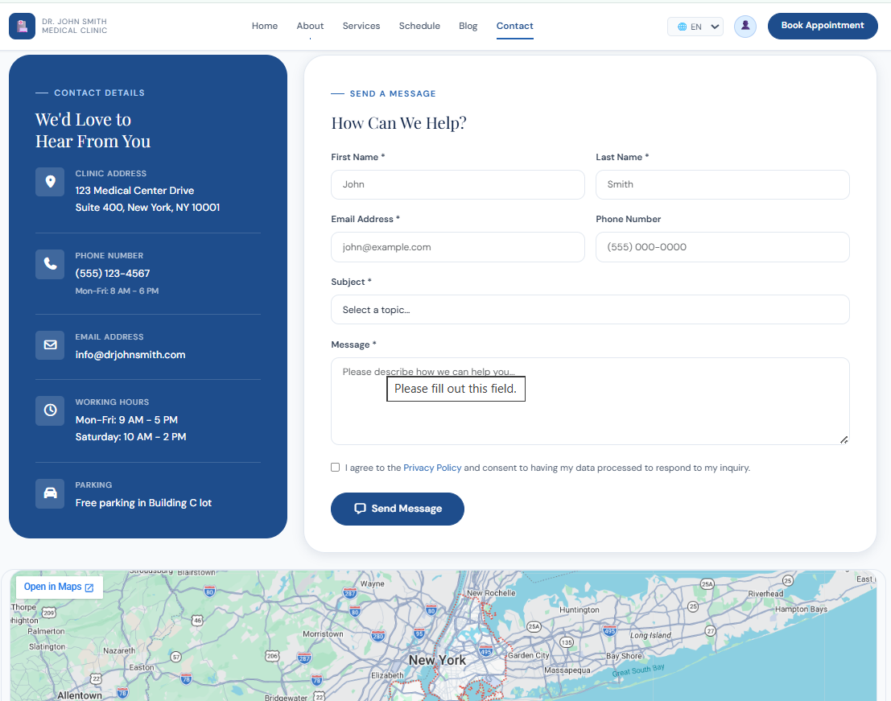

# Healthcare Website Platform

A modern, fully responsive healthcare website designed for medical clinics, hospitals, and healthcare professionals. The platform provides an intuitive user experience with appointment scheduling, service information, multilingual support, and engaging animations.

## 📸 Project Screenshots

<p align="center">
  <h3>Homepage / Dashboard</h3>
  
  <br><br>
  <h3>Appointment Scheduling</h3>
  
  <br><br>
  <h3>Services</h3>
  
  <br><br>
  <h3>Blog</h3>
  
  <br><br>
  <h3>Contact</h3>
  
</p>

## 🚀 Features

- **Responsive Design:** Optimized for seamless viewing on desktops, tablets, and smartphones.
- **Appointment Scheduling:** User-friendly forms for booking consultations.
- **Multilingual Support:** Built-in accessibility for a diverse range of patients.
- **Comprehensive Portals:** Dedicated layouts for dashboards, services, and user authentication.
- **Smooth Visuals:** Interactive elements paired with engaging modern animations.

## 📁 Repository Structure

```text
├── assets/             # Images, icons, and graphic media
├── css/                # Stylesheets defining the visual theme
├── js/                 # JavaScript files powering website logic & animations
├── screenshots/        # Project screenshots for documentation
├── index.html          # Homepage / main landing page
├── about.html          # Clinic history, mission, and team profile
├── services.html       # Detailed overview of medical treatments
├── blog.html           # Healthcare articles, news, and updates
├── contact.html        # Interactive contact form and location details
├── login.html          # Secure patient/staff login gateway
├── signup.html         # New account registration page
├── dashboard.html      # Personalized user portal dashboard
└── schedule.html       # Appointment booking management interface
```

## 🛠️ Tech Stack

- **Frontend:** HTML5, CSS3, JavaScript
- **Animations:** Custom CSS transitions / JS animation libraries

## 💻 Getting Started

To view and run this project locally, follow these simple steps:

1. **Clone the repository:**
   ```bash
   git clone https://github.com
   ```
2. **Navigate into the project folder:**
   ```bash
   cd YOUR-REPO-NAME
   ```
3. **Launch the platform:**
   - Double-click `index.html` to open it instantly in your default web browser.
   - Alternatively, right-click `index.html` and use a local development tool like VS Code's **Live Server** extension.

## 👥 Contributors

- **Soham Walhekar** ([@walhekarsoham](https://github.com))
